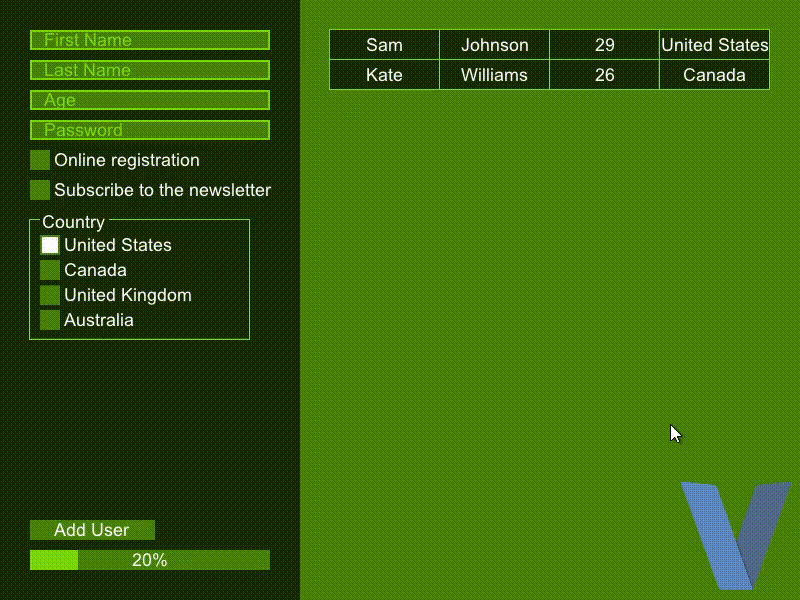
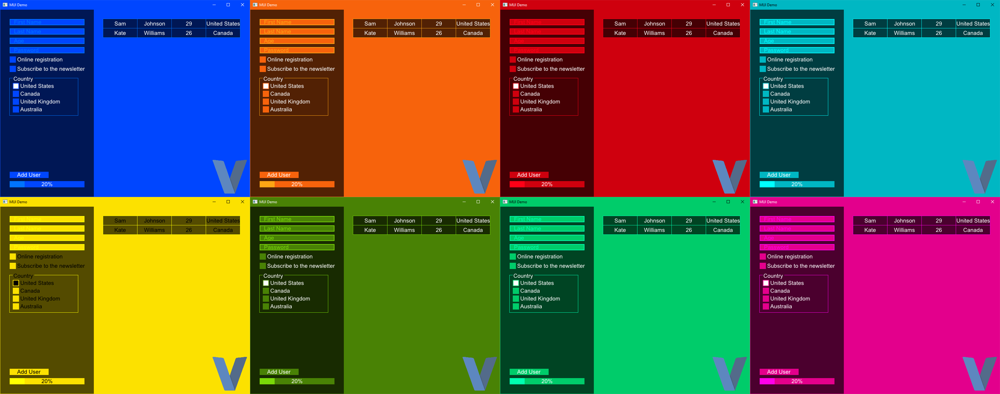

#  - A Cross-Platform UI Library _for V & C_



> **Supports Windows, Linux, Android<sup>1</sup>** & Web<sup>2</sup> (Experimental). *Not tested on MacOS<sup>3</sup>.*

> 1: System themes & map widget not working on Android now. If you interested with compiling for android, look [here](#compile-for-android)

> 2: With Emscripten. System themes & map widget not working now. If you interested with compiling for web, look [here](#compile-with-emscripten)

> 3: All critical processes (like Widget drawing, click handling etc.) should work on MacOS. But themes and screen reader won't work, and could be include MacOS-only bug.

## Example

```v
import malisipi.mui as m

fn increase_count(event_details m.EventDetails,mut app &m.Window, mut app_data voidptr){
	unsafe {
		app.get_object_by_id("count")[0]["text"].str = (app.get_object_by_id("count")[0]["text"].str.int() + 1).str()
	}
}

mut app := m.create(title:"Counter - MUI Example", height:100, width:400)

app.label(id:"count", x:"5%x", y:"5%y", width:"45%x", height:"90%y" text:"0")
app.button(id:"count_button", x:"# 5%x", y:"5%y", width:"45%x", height:"90%y", text:"Count", onclick:increase_count)

app.run()
```

> You can find more examples in `./examples/` folder. Also you can visit [Gallery](./gallery.md "Gallery") that lists applications screenshots uses MUI.

> You can test MUI easily from [here](https://malisipi.github.io/mui/).

## Abilities

* C Bindings (Desktop Only & Experimental)
* Theme from system accent color, _If couldn't found accent color, use dark/light theme preference. If couldn't found dark/light theme preference, choose light theme_

* [Webview Window](#how-to-compile-programs-that-use-malisipimuiwebview)
* Widgets
    * Slider (Verical & Horizontal)
    * Button
    * Label
    * Textbox
    * Password
    * Group
    * Rect
    * Image
    * Progress
    * Radio Button
    * Checkbox
    * Link
    * Selectbox
    * Table
    * Graphs
        * Line Graph
        * Area Graph
    * Menubar
    * Map (Desktop Only)
    * Switch
    * Textarea
    * Codefield
    * Scrollbar (Verical & Horizontal)
    * Frames & Nested-Frames
    * List View
    * Spinner (aka UpDown)
    * Tabbed View
* Custom/Thirdparty Widget Support (Not Finished Completely Yet)
* Screen Reader Support (Experimental - Linux & Windows Only)
* Emoji Icon Support (Desktop Only)
* Dialogs
    * Messagebox (Tinyfiledialogs & built-in & web)
    * Inputbox (Tinyfiledialogs & built-in & web)
    * Passwordbox (Tinyfiledialogs & built-in & web)
    * Color Chooser (Tinyfiledialogs & built-in & web)
    * File Open/Save Dialog (Tinyfiledialogs)
    * Folder Open Dialog (Tinyfiledialogs)
    * Notification Support (Tinyfiledialogs)
    * Custom Dialog Support (Not Finished Completely Yet)
* Anchor System
* Transition Animations (Supports Anchors)
* File Drag-n-Drop (Desktop Only)
* Z-Index Support
* Ask Quit Dialog & Quit Function (Desktop Only)
* Keybindings _Will be ignored pressed keys/key combinations that used by widgets if the assigned function to the key/key combination._
* Japanese Input Support (Experimental)

> To see all created and planned features, look up [To-Do List](https://github.com/malisipi/mui/issues/22)

## Thirdparty Widgets/Plugins

You can make your MUI applications more powerful with plugins.

> Browse [MUI plugin list](./plugins.md)

## Installation

> To install, run `v install https://github.com/malisipi/mui`

> To remove, run `v remove malisipi.mui`

## Compile-Time Flags

| Flags                      | Description                                               |
|----------------------------|-----------------------------------------------------------|
| `-d show_fps`              | Show FPS of the window                                    |
| `-d no_emoji`              | Disable emoji support and font embedding                  |
| `-d emscripten`            | Compile for emscripten (use with `-os wasm32-emscripten`) |
| `-d dont_clip`             | For debugging purposes, it disables clipping the widgets area. (Not recommend) |
| `-d power_save`            | Enables power save mode. It's recommend if your application require more resource or you're running the application on low-hardware computer. Some drawing lags would be appeared with the flag, please report them. |
| `-d support_japanese_input`| Support basic japanese input                              |

## Compile for android

* You need to use [V Android Bootstrapper](https://github.com/vlang/vab) to compile for Android.
* Tinyfiledialogs won't work on Android, but you can use built-in dialogs.
* If you want to working keyboard, you need patch the sokol library that placed into v/thirdparty. You can found the patch file from `./patches`.

## Compile with emscripten

How to compile demo.v with emscripten:
```bash
[~/.vmodules/malisipi/mui/examples]$ v -d emscripten -d no_emoji -gc none -os wasm32-emscripten demo.v -o emscripten_.c

[~/.vmodules/malisipi/mui/examples]$ cat emscripten_.c | sed 's/waitpid(p->pid, &cstatus, 0);/-1;/g' | sed 's/waitpid(p->pid, &cstatus, WNOHANG);/-1;/g' | sed 's/wait(0);/-1;/g' &> emscripten.c

[path/to/dir/v]$ emcc -fPIC -Wimplicit-function-declaration -w  thirdparty/stb_image/stbi.c -I/usr/include/gc/   -Ithirdparty/stb_image -Ithirdparty/fontstash -Ithirdparty/sokol -Ithirdparty/sokol/util    -DSOKOL_GLES2 -DSOKOL_NO_ENTRY   -DNDEBUG -O3   -s ERROR_ON_UNDEFINED_SYMBOLS=0 -s ALLOW_MEMORY_GROWTH -s MODULARIZE -s ASSERTIONS=1 ~/.vmodules/malisipi/mui/examples/emscripten.c -o ~/.vmodules/malisipi/mui/examples/app.js --embed-file ~/.vmodules/malisipi/mui/assets/noto.ttf@/noto.ttf --embed-file ~/.vmodules/malisipi/mui/examples/v-logo.png@v-logo.png
```

## How to Compile Programs that use malisipi.mui.webview?

* You must to compile webview.o for one time before starting to building your applications.

* For Windows
    * Requirenments:
        * GCC (need to be inside Path) 
        * [Microsoft Edge Webview2 Runtime](https://developer.microsoft.com/en-us/microsoft-edge/webview2/) (Pre-installed in latest Windows 10 and Windows 11)
    * `%USERPROFILE%\.vmodules\malisipi\mui\webview> build_webview_for_windows.cmd`
    * `X:\path\to\example> copy "%USERPROFILE%\.vmodules\malisipi\mui\webview\webview2\runtimes\win-`<win_arch>`\native\WebView2Loader.dll"` `"X:\path\to\example"`
    * `X:\path\to\example> v -cc gcc example.v`

* For Linux 
    * Requirenments:
        * GCC
        * `libgtk-3-dev` and `libwebkit2gtk-4.0-dev` package (on Debian-based systems)
    * `[~/.vmodules/malisipi/mui/webview/]$ ./build_webview_for_linux.sh`
    * You're ready to go!

## Known Bugs

For Windows;
* MSVC and TCC (without full-winapi, look below) not works. I strongly suggest GCC to compile your programs. `v -cc gcc ...`

> If you have a problem/question or feature request about MUI, you can create a issue.

## FAQ

<details><summary><b>How to use TCC on Windows</b></summary>

* If you're using webview sub-module, TCC never works. Also some functions will be ignored with TCC. But you can still use TCC for Windows to compile faster.
* You need full winapi for TCC. [winapi-full-for-0.9.27.zip at download-mirror.savannah.gnu.org](https://download-mirror.savannah.gnu.org/releases/tinycc/) Download it and extract.
* Move ```path\to\winapi-full-for-0.9.27\include\winapi``` to ```C:\winapi```.
* ```v -cc tcc run example.v```
* And it's works like a charm.

</details>

<details><summary><b>MUI is freezing with blank window and crashing with `gg error: WGL: ARB_create_context_profile required!` error (For Windows OS)</b></summary>

>  Probably, it's a issue about your drivers. You will need to ensure that you have downloaded and installed a recent driver for your graphics hardware. If your system does not contain a GPU, or the GPU vendor delivers graphics drivers providing OpenGL support that's so old as to be useless to you, you might want to consider installing the Mesa3D OpenGL library on your system.

[Installing Mesa3D on Windows](https://www.khronos.org/opengl/wiki/Platform_specifics:_Windows#Installing_Mesa3D_on_Windows)

[Also you can download pre-built library from here](https://fdossena.com/?p=mesa/index.frag)

</details>

<details><summary><b>MUI not working with old-V versions</b></summary>

> V is still beta and MUI require to break support of V's old versions to supporting latest.

* Update V version

or 

* If you need specific V edition, look up commit history and use a commit that released with similar times.

</details>

<details><summary><b>What is operating system of test devices?</b></summary>

* Windows 11
* Arch Linux
* Android 12
* Windows 7/10 (Sometimes)
* Wine 8.x (Sometimes)

</details>

<details><summary><b>Can I have tray library for MUI?</b></summary>

> [VTray](https://github.com/Ouri028/VTray) library is created for this goal. So we don't require an built-in tray library for MUI. If you see any issue about MUI interoperability with this library, please report it to fix it.

</details>

## Suggestions

* You should run processes that required more time than 0.2s as concurrent. If you don't, app couldn't response until finish processes.
    * Also dialogs (specially, built-in dialogs) must to be runned concurrent as different functions than main threads. If don't, app never response.
    ```v
    //Don't (App never response when call the function)
    fn run_dialog(event_details m.EventDetails,mut app &m.Window, app_data voidptr){
        app.create_dialog(m.Modal{typ:"messagebox",message:"Hello, "+app.wait_and_get_answer(),title:"Hi!"})
        print(app.wait_and_get_answer())
    }

    //Do
    fn do_another_process(mut app &m.Window){
        app.create_dialog(m.Modal{typ:"messagebox",message:"Hello, "+app.wait_and_get_answer(),title:"Hi!"})
        print(app.wait_and_get_answer())
    }

    fn run_dialog(event_details m.EventDetails,mut app &m.Window, app_data voidptr){
        go do_another_process(mut app)
    }
    ```

## License

* **This project licensed by [Apache License 2.0](./LICENSE).**
* [Tinyfiledialogs](https://sourceforge.net/projects/tinyfiledialogs/) (`./tinyfiledialogs/`) (Patched) licensed by Zlib License.
* [Noto Emoji Font](https://fonts.google.com/noto/specimen/Noto+Emoji) (`./noto_emoji_font/`) licensed by OFL License.
* [Noto Font](https://fonts.google.com/noto/specimen/Noto+Sans) (`./assets/noto.ttf`) licensed by OFL License.
* [Noto (Japanese) Font](https://fonts.google.com/noto/specimen/Noto+Sans+JP) (`./assets/noto_jp.ttf`) licensed by OFL License.
* [V-logo](https://github.com/vlang/v-logo) (`./examples/v-logo.png`) licensed by MIT License.
* [Original Sokol](https://github.com/floooh/sokol) and [Sokol Patch](https://github.com/floooh/sokol/pull/503) (`./patches/sokol_android_keyboard.patch`) licensed by Zlib license.
* [Webview](https://github.com/malisipi/vebview-webview) (`./webview/webview`) (Patched) licensed by MIT License.
* [Webview2 (1.0.1264.42)](https://www.nuget.org/packages/Microsoft.Web.WebView2/) (`./webview/webview2`) -> [License](./webview/webview2/LICENSE.txt).

## Documentation

You can read documentation from these links.
* [mui](./docs_md/mui.md)
* [mui.webview](./docs_md/webview.md)
